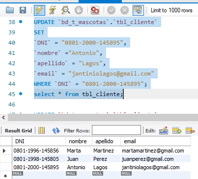

# **Tarea Semana 3 Desarrollo de Aplicaciones Web 1**

## Diagrama Entidad Relacion de la base de datos Tienda de Mascotas

### En este repositorio encontraremos un archivo **SQL** llamado crear base de datos y tablas  el cual contiene el escript con el cual se creara una base de datos con el nombre de **bd_t_mascotas** la cual consta de 7 tablas mencionadas a continuacion: **tbl_mascota**, **tbl_cliente**, **tbl_factura**, **tbl_productos**, **tbl_proveedores**, **tbl_suministra**, **tbl_disponible**. Esta base de datos se basa en una tienda de mascotas y venta de productos para las mismos
#
### Una vez haya ejecutado el script del archivo antes mensionado, el cual lo ejecutara en su gestor de base de datos preferido procederemosa a hacer inserciones en nuestra base de datos.
### Solo nos enfocaremos en tres tablas **tbl_mascota**, **tbl_cliente** y **tbl_proveedores**
#
### Junto al archivo llamado crear base de datos y tablas se encuente otro archivo con los comandos SQL para **insert**, **update** y **delete** en donde cada una de estas acciones en cada tabla esta comentada de la siguiente forma:
#

#

#

#
### Procederemos a realizar un **INSERT** en la Tabla clientes la cual no contiene datos 

#
### Ejecutamos El script

#
### si no se presenta ningun error en el script, tendremos este resultado

#
### Una vez  hayamos tenido exito en el **INSERT** de datos procederemos a realizar un **UPDATE**
### En la sigiente imagen nos enfocaremos en el cliente con el DNI: 0801-2000-145895

#
### Ejecutaremos el siguiente script y podremos observar que se a actualizado sus datos

#
### Una vez  hayamos tenido exito en el **INSERT** y el **UPDATE** de datos procederemos a realizar un **DELETE**
#
### En la sigiente imagen se muestra los registros que realizamos anteriormente  del cual eliminaremos al cliente con DNI: 0801-2000-145895

#
### en la siguiente imagen podemos obserbar que se borro exitosamente

#
### Realizaremos estos mismos procedimientos en las tablas **tbl_cliente** y **tbl_proveedores**
#
## Pos Data: En el caso de la tabla de mascotas se usa como identificador unico el id al cual se le asigno un auto_incremental por lo que el valor del id puede ser diferentes al que se muestra en los ejemplos al momento que usted realice un **insert**, **update** y **delete**